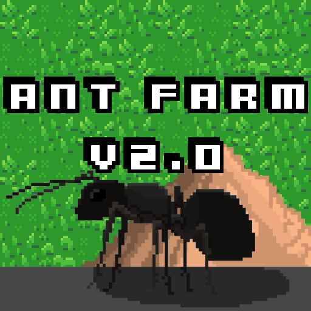

# Ant Farm v2.0

Welcome to **Ant Farm v2.0**, a sequel to the critically acclaimed **Ant Farm v1.0**.  

## Building
See [BUILDING.md](BUILDING.md) for instructions on how to build.

## Gameplay
In **Ant Farm v2.0**, you play as an ant who must navigate through a dangerous world filled with obstacles and enemies.  
To succeed, you must use your wits and agility to **follow** pheromone trails and **crush** rival ant hills.  

The game features beautiful 2D pixel art and a challenging yet rewarding gameplay experience.  
With hours of content to enjoy, **Ant Farm v2.0** is a must-play for all fans of RPG games.

## Reviews
Don't believe us? Read the magnificent reviews from happy customers:
 - 5/5 stars, **NathanW** - *"An addicting and challenging puzzle game that'll have you coming back for more."*
 - 5/5 stars, **ianmc05** - *"The pixel art is gorgeous and the gameplay is super satisfying. I can't get enough of this game!"*
 - 5/5 stars, **ARZI** - *"A must-play for all fans of RPG games. Ant Farm v2.0 is a challenging yet rewarding experience that is sure to please."*

We also believe in sharing the negative views, so you can get the whole picture:
 - 1/5 stars, **TheTroll2001** - *"Uh, I've had this since 2017, you stole it."*
 - 1/5 stars, **mankool** - *"After downloading Ant Farm v2.0, I logged back in to see that my ~~lag machine~~ pigman farm had been griefed!!!! DO **NOT** DOWNLOAD!!"*
 - 1/5 stars, **SirLeonidas** - *"Ant Farm v2.0 is a terrible game that is nothing more than a virus in disguise. It not only turns on your webcam without your permission, but it also leaks your Minecraft coordinates! My fish stash got griefed after I ran this :(."*
